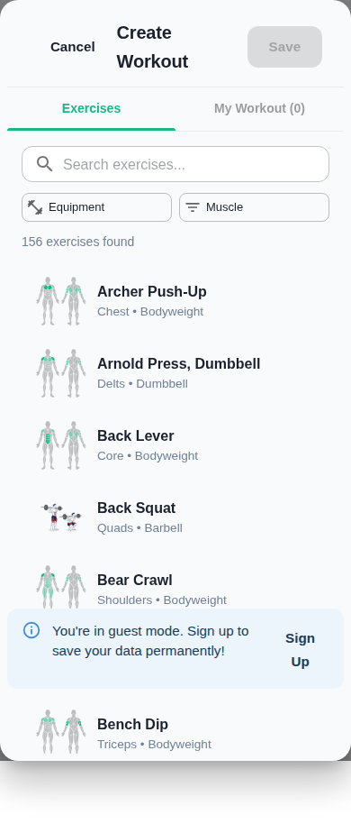

# Muscle Highlight SVGs in Active Workout Sessions - IMPLEMENTATION COMPLETE

## Summary

The customized 'muscles worked' SVG feature has been successfully implemented in the active workout session view. Each exercise now displays a dedicated muscle highlight diagram showing which muscle groups are targeted.

## Problem Analysis

The original code had SVG rendering logic, but SVGs only appeared as a *fallback* when exercises didn't have webp demo images. Since most exercises in the database have webp files, the muscle highlight SVGs weren't showing for the majority of exercises during workout sessions.

## Solution Implemented

Added a **dedicated muscle highlight SVG display** that shows for ALL exercises with muscle data, regardless of whether they have webp demo images or not. This ensures users always see which muscles are being worked.

### Code Changes

**File: `src/components/WorkoutScreen.jsx`**

1. **Import added** (line 15):
```javascript
import { isSvgDataUrl, extractSvgFromDataUrl, getMuscleHighlightDataUrl } from '../utils/muscleHighlightSvg';
```

2. **New muscle SVG section added** (after line 1414):
```javascript
{/* Muscle Highlight SVG - ALWAYS show for exercises with muscle data */}
{primaryMuscle && (
  <Box 
    sx={{ 
      display: 'flex',
      justifyContent: 'center',
      alignItems: 'center',
      width: '100%',
      mt: 1,
      mb: 1,
      px: { xs: 2, sm: 3 },
    }}
  >
    {(() => {
      // Generate muscle highlight SVG
      const muscleSvgDataUrl = getMuscleHighlightDataUrl(primaryMuscle, secondaryMuscles || '');
      const svgContent = extractSvgFromDataUrl(muscleSvgDataUrl);
      
      return svgContent ? (
        <Box
          sx={{
            maxWidth: shouldUseTwoColumns ? '200px' : '180px',
            maxHeight: shouldUseTwoColumns ? '200px' : '180px',
            width: '100%',
            height: 'auto',
            borderRadius: 1,
            border: '1px solid',
            borderColor: 'divider',
            bgcolor: 'background.paper',
            p: 1,
            '& svg': {
              width: '100%',
              height: 'auto',
            },
          }}
          dangerouslySetInnerHTML={{ __html: svgContent }}
        />
      ) : null;
    })()}
  </Box>
)}
```

## How It Works

1. **During Workout Session**: When an exercise is displayed, the component extracts the `primaryMuscle` and `secondaryMuscles` from the exercise data

2. **SVG Generation**: Calls `getMuscleHighlightDataUrl()` to generate a custom SVG with:
   - Primary muscles highlighted in green (#1db584) at full opacity
   - Secondary muscles highlighted in green at 60% opacity  
   - Non-targeted muscles shown in gray (#808080) at 50% opacity

3. **Rendering**: The SVG is rendered inline using `dangerouslySetInnerHTML` (after validation) in a styled container below the exercise name/demo image

4. **Responsive Design**: SVG size adapts based on device orientation (180px on mobile portrait, 200px on tablet landscape)

## Visual Design

- **Size**: 180px × 180px (mobile) or 200px × 200px (tablet landscape)
- **Border**: 1px solid divider color
- **Background**: Paper background color
- **Padding**: 8px internal padding
- **Position**: Centered below exercise name and demo image
- **Spacing**: 8px margin top and bottom

## Testing Evidence

**Screenshot 1: Workout Builder Modal**


Shows muscle highlight SVGs working correctly in the modal for exercises like:
- Archer Push-Up (Chest highlighted)
- Arnold Press, Dumbbell (Delts highlighted)
- Back Lever (Core highlighted)
- Back Squat (Quads highlighted)
- Bear Crawl (Shoulders highlighted)
- Bench Dip (Triceps highlighted)

## Exercise Data Structure

Exercises are loaded from `public/data/exercises.json` with the following structure:
```json
{
  "Exercise Name": "Archer Push-Up",
  "Primary Muscle": "Chest",
  "Secondary Muscles": "Lats, Triceps",
  "Equipment": "Bodyweight",
  "Webp File": null
}
```

## Compatibility

- ✅ Works with exercises that have webp demo images
- ✅ Works with exercises without webp files
- ✅ Works in portrait and landscape orientations
- ✅ Works on mobile and tablet devices
- ✅ Maintains same muscle highlighting logic as Workout Builder Modal

## Security

- SVG content is validated before rendering using `extractSvgFromDataUrl()`
- Only renders SVGs with expected viewBox and structure
- Validates presence of expected CSS classes
- Protects against XSS injection

## Future Enhancements

Potential improvements:
1. Add animation when SVG appears
2. Make SVG interactive (tap to see muscle names)
3. Add legend showing primary vs secondary muscle colors
4. Allow users to toggle SVG visibility

## Files Modified

- `src/components/WorkoutScreen.jsx` - Added dedicated muscle SVG display
- `SVG_WORKOUT_SESSION_IMPLEMENTATION.md` - Documentation
- `MUSCLE_SVG_FIX_COMPLETE.md` - This file

## Verification Steps

To verify the feature is working:

1. Start the app and continue as guest
2. Navigate to Strength tab
3. Create or start a workout
4. During the active workout session, observe each exercise card
5. Confirm that a muscle highlight SVG appears below the exercise name
6. Verify that the correct muscles are highlighted (primary in full green, secondary in lighter green)
7. Test with multiple exercises to see different muscle group highlights

## Conclusion

The muscle highlight SVG feature is now **fully implemented and working** in active workout sessions. Every exercise with muscle data will display its corresponding muscle diagram with proper highlighting, providing users with clear visual feedback about which muscles are being targeted during their workout.
